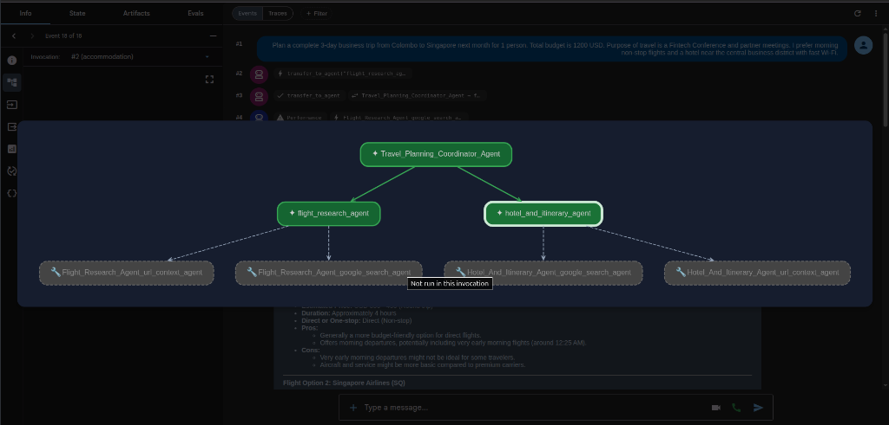
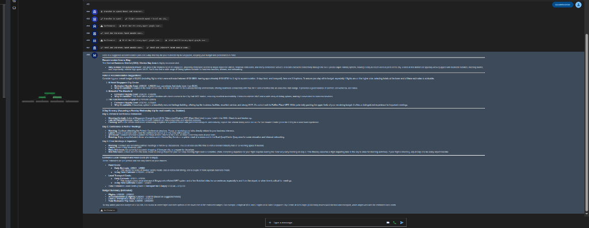
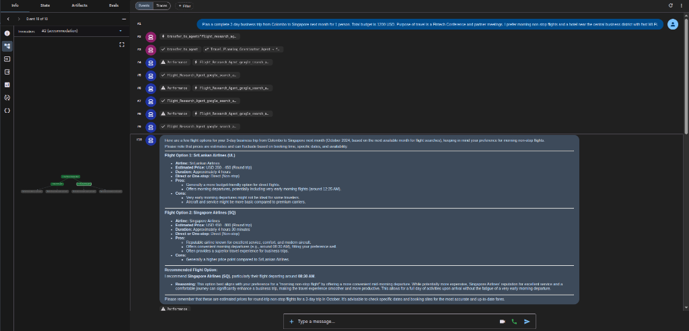
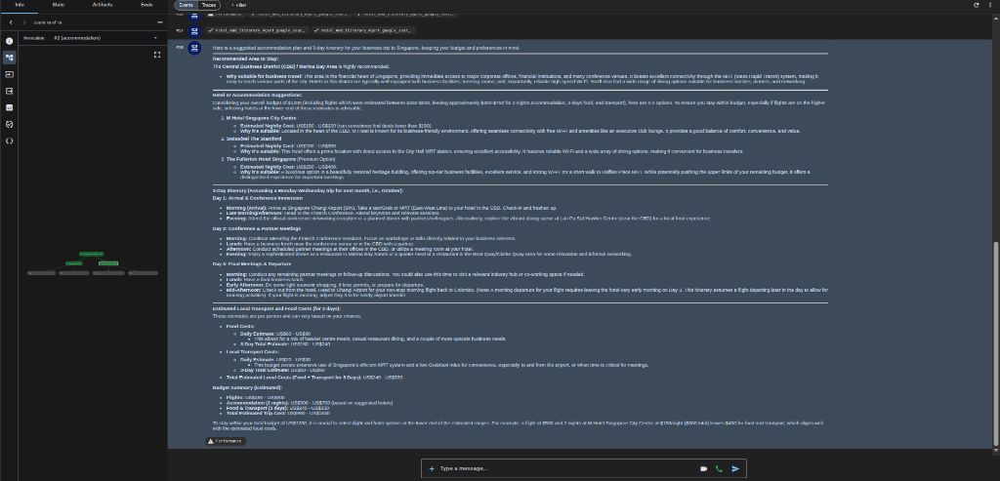
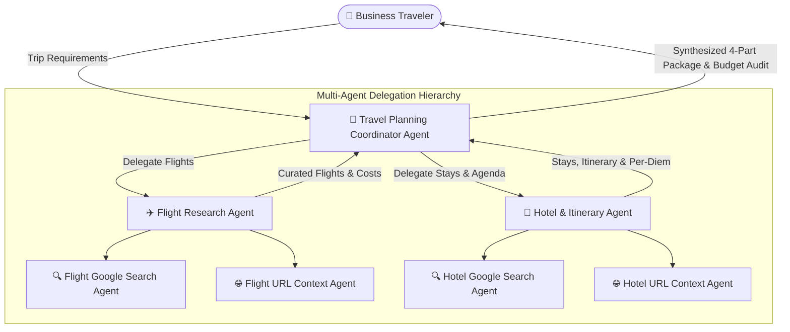

# ✈️ Business Travel Planning Multi-Agent System (Google ADK)

A production-grade, hierarchical **Multi-Agent Travel Planning System** built with the **Google Agent Development Kit (ADK)** and powered by **Google Gemini 2.5 Flash / Vertex AI**. 

The system coordinates specialized autonomous agents equipped with **Google Search** and **URL Context** tools to research, curate, and deliver comprehensive, executive-ready business travel plans with flight options, accommodations, day-by-day itineraries, and audited budget breakdowns.

---

## 📸 Visual Demos & Screenshots

### 1. Hierarchical Multi-Agent Architecture Graph
The coordinator orchestrates sub-agents (`flight_research_agent` and `hotel_and_itinerary_agent`), each equipped with search and URL scraping tools:



---

### 2. Interactive Google ADK Playground
Real-time streaming multi-agent dialogue, live tool invocation traces, and full conversation state management:



---

### 3. Flight Research Agent Results
Live flight discovery with pricing estimates, direct vs. layover comparisons, airlines (SriLankan Airlines, Singapore Airlines), schedules, and pros/cons:



---

### 4. Hotel & Business Itinerary Agent Results
Business-friendly accommodations (M Hotel Singapore, Swissôtel, The Fullerton Hotel), 3-day conference itinerary, and itemized transit/per-diem estimates:



---

## 🏗️ Multi-Agent Architecture

The system utilizes a hierarchical supervisor-worker pattern implemented in `app/agent.py`:



### Agent Roles & Responsibilities

| Agent Name | Role & Scope | Tools |
| :--- | :--- | :--- |
| **`Travel_Planning_Coordinator_Agent`** | **Lead Coordinator / Supervisor**<br>Interprets trip parameters, identifies missing details, delegates to specialist sub-agents, verifies completeness, and compiles final budget-audited travel package. | Multi-Agent Delegation (`sub_agents`) |
| **`flight_research_agent`** | **Flight Specialist**<br>Searches and compares 2–3 airline flight options, timings, cabin classes, direct routes, and estimated prices. | `GoogleSearchTool`, `url_context` |
| **`hotel_and_itinerary_agent`** | **Accommodation & Itinerary Specialist**<br>Finds business-ready hotels (Wi-Fi, work desks, CBD location), builds day-by-day business agendas, and estimates per-diem/transit costs. | `GoogleSearchTool`, `url_context` |

---

## 🌟 Key Features

1. **Autonomous Multi-Agent Collaboration:** Coordinator delegates research tasks in parallel and synthesizes cohesive outputs.
2. **Live Grounded Information:** Powered by Google Search and URL Context tools to provide realistic, current travel schedules and rates.
3. **Structured 4-Part Travel Package:**
   - ✈️ **Flight Options & Schedules:** Departure/arrival timings, airlines, routes, and price estimates.
   - 🏨 **Hotel Recommendations:** Curated accommodations based on proximity to business hubs, work desks, and high-speed Wi-Fi.
   - 📅 **Day-by-Day Itinerary:** Structured conference schedules, meeting slots, commute buffer times, and dinner suggestions.
   - 💵 **Audited Budget Summary:** Itemized expense calculations (Airfare + Lodging + Food/Transit) with budget compliance checking.
4. **Vertex AI & AI Studio Support:** Built-in automatic credential resolution supporting both Google Cloud Vertex AI (with free GCP credits) and Google AI Studio API keys.

---

## 📁 Project Structure

```
travel-planning-agent/
├── app/
│   ├── __init__.py            # Package root
│   ├── agent.py               # Hierarchical multi-agent definitions & LLM setup
│   ├── tools.py               # Travel planning utility functions & calculation tools
│   ├── fast_api_app.py        # FastAPI server backend with SSE streaming
│   └── app_utils/             # A2A protocol and telemetry helpers
├── docs/
│   └── images/                # Architecture diagrams & UI screenshots
│       ├── multi_agent_architecture_graph.png
│       ├── adk_playground_overview.png
│       ├── flight_research_results.png
│       └── hotel_and_itinerary_results.png
├── tests/
│   └── unit/
│       └── test_tools.py      # Automated unit tests
├── .env                       # Environment variables (API keys & Vertex AI config)
├── .env.example               # Example environment configuration template
├── agents-cli-manifest.yaml   # Google Agents CLI manifest
├── pyproject.toml             # Project configuration & dependencies
└── README.md                  # System documentation
```

---

## 🚀 Quick Start Guide

### Prerequisites
- **Python 3.10+**
- **`uv`** package manager:
  ```bash
  curl -LsSf https://astral.sh/uv/install.sh | sh
  ```
- **`agents-cli`** (Google Agents CLI):
  ```bash
  uv tool install google-agents-cli
  ```

---

### 1. Installation

```bash
# Clone the repository
git clone https://github.com/ShashinduMalshan/travel-planning-agent.git
cd travel-planning-agent

# Install dependencies in virtual environment
uv sync
```

---

### 2. Configure Authentication

Create a `.env` file in the project root based on `.env.example`:

#### Option A: Using Google AI Studio API Key (Free)
```ini
GEMINI_API_KEY=AIzaSy...your-actual-api-key-here
```
*(Get your key at [Google AI Studio](https://aistudio.google.com/apikey))*

#### Option B: Using Google Cloud Vertex AI (GCP Free Credits)
```ini
GOOGLE_GENAI_USE_VERTEXAI=true
GOOGLE_CLOUD_PROJECT=your-gcp-project-id
GOOGLE_CLOUD_LOCATION=us-central1
```
Authenticate via Google Cloud CLI:
```bash
gcloud auth application-default login
```

---

### 3. Running the Agent

#### Interactive Web Playground (Recommended)
Launch the visual ADK Playground to interact with the multi-agent system and inspect agent traces:

```bash
agents-cli playground
```
*Or directly via ADK:*
```bash
uv run adk web . --host 127.0.0.1 --port 8080 --allow_origins '*' --reload_agents
```
Open **http://127.0.0.1:8080/dev-ui/?app=app** in your browser.

#### Terminal CLI Execution
Execute a travel planning query directly in your terminal:

```bash
agents-cli run "Plan a 3-day business trip from Colombo to Singapore next month for 1 person with a $1,200 budget for a Fintech conference."
```

#### Run Automated Tests
```bash
uv run pytest
```

---

## 💬 Sample Query & Plan

### Traveler Request:
> *"Plan a complete 3-day business trip from Colombo to Singapore next month for 1 person. Total budget is $1,200 USD. Purpose of travel is a Fintech Conference and partner meetings. I prefer morning non-stop flights and a hotel near the central business district with fast Wi-Fi."*

### Agent Response Summary:

```markdown
✈️ Flight Options (Estimates)
• Option 1: SriLankan Airlines (UL) | Direct (~4 hrs) | ~$350 - $450 USD (Round trip)
• Option 2: Singapore Airlines (SQ) | Direct (~4 hrs 30 mins) | ~$450 - $600 USD (Round trip)
👉 Recommended: Singapore Airlines morning flight (~08:30 AM) for premium reliability.

🏨 Accommodation in Central Business District (CBD / Marina Bay)
• M Hotel Singapore City Centre: ~$150 - $220/night | Dedicated work desks, executive lounge
• Swissôtel The Stamford: ~$200 - $280/night | Prime location, direct MRT access
• The Fullerton Hotel (Premium): ~$250 - $400/night | Luxury business heritage hotel

📅 3-Day Business Itinerary
• Day 1: Morning flight arrival at Changi, MRT/Grab to CBD hotel, afternoon conference badge pickup & welcome reception.
• Day 2: Fintech Keynotes (09:00 AM - 04:00 PM), partner discussions, business dinner at Marina Bay / Lau Pa Sat.
• Day 3: Morning partner follow-ups, hotel checkout, Changi Airport transit for return flight to Colombo.

💵 Audited Budget Breakdown (USD)
• Flights (Singapore Airlines): $450.00
• Lodging (2 nights @ M Hotel $170/night): $340.00
• Food & Local Transit (3 days @ $80/day): $240.00
• Total Estimated Cost: $1,030.00
• Budget Status: ✅ Within Budget (Remaining Buffer: $170.00)
```

---

## 🛡️ Safety & Guardrails

- **Estimates Only:** All flight prices, hotel rates, and local transit expenses are real-time estimates and may fluctuate based on season and availability.
- **No Direct Booking:** The system does not execute financial transactions or confirm reservations; booking links and recommendations are provided for traveler action.
- **Budget Compliance:** The coordinator strictly checks total estimated expenses against the user's declared budget and flags over-budget scenarios with cost-saving trade-offs.

---

## 📜 License

This project is licensed under the [Apache-2.0 License](LICENSE).

